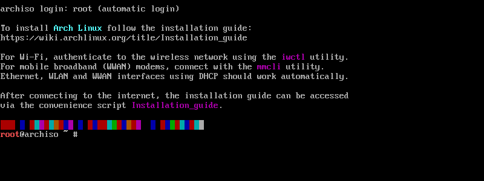

# linux4family
Extremely Easy Linux Installation &amp; Post-Install Setup Guide (Arch, KDE-Plasma)

**Turn off SecureBoot in your BIOS before starting**

## Prepare USB

1. Download Ventoy and install it onto your USB
   →https://www.ventoy.net/en/download.html
2. Download Arch iso and sig(Or ask me for it)
   →https://archlinux.org/download/
3. Copy the verified arch.iso file onto the USB

---

## Reboot PC into USB

1. Shut down → Turn on
2. Follow on-screen instructions for booting into USB
3. Choose **Temporary startup device** (usually F12) → Choose your USB
3. Screen should show **VENTOY**
4. Select **archlinux-*yyyy.mm.dd*-x86_64.iso** → Enter → **Boot in normal mode** → Enter

---

1. Once booted into USB, select top option.
You should now see this:



---

## Connect to Wifi for **archinstall**

1. Run the following commands one by one:

```bash
iwctl
station wlan0 scan
station wlan0 connect "your-wifi-name"
quit
archinstall
```

---

## Installation Settings (Archinstall)

If it is not mentioned, use the default

| Option                        | Setting                                      |
|-------------------------------|----------------------------------------------|
| **Mirrors**                   | United States                                |
| **Partition**                 | BTRFS (autosuggested, single partition, compression) |
| **LVM**                       | No                                           |
| **Disk encryption**           | No                                           |
| **Btrfs snapshots**           | No                                           |
| **Swap**                      | Enabled                                      |
| **Bootloader**                | systemd-boot                                 |
| **Unified kernel image**      | Yes                                          |
| **Hostname**                  | Example: `workstation` / `laptop` / `homepc` |
| **Authentication**            | Example: `root` / `yourname` / `guest`       |
| **Profile**                   | KDE Plasma                                   |
| **Applications**              | Bluetooth Enabled                            |
| **Audio**                     | PipeWire                                     |
| **Kernel**                    | `linux-lts`                                  |
| **Network**                   | NetworkManager                               |
| **Additional packages**       | `base-devel breeze-plymouth coreutils git intel-media-driver intel-ucode kde-applications less plymouth-kcm sddm-kcm vim xdg-user-dirs xorg-xwayland` |
| **Timezone**                  | `America/Los_Angeles`                        |
| **NTP**                       | Enabled                                      |

1. After finishing full install, reboot and remove USB

---

## After First Successful Boot

1. Connect to Wi-Fi or Ethernet  
2. Open **Konsole** and run the following commands one by one:

```bash
mkdir ~/builds && cd ~/builds
git clone https://aur.archlinux.org/yay-bin.git
cd yay-bin
makepkg -si
git config --global commit.gpgsign true
cd; git clone https://github.com/brianspragge/linux4family.git
```

> Optional: Copy useful dotfiles from the `personal` repo to ~/ and ~/.local/bin 
> Recommended: `.bashrc`, `.vimrc`, `.inputrc`, `~/.local/bin/gpgcli`

---

## Temporary Plymouth Splash Screen Fix (Remove boot text)

```bash
sudo vim /etc/kernel/cmdline
```

→ Add ` splash quiet` at the end of the line  
→ Press `i` → edit → `Esc` → `:wq` → Enter

---

## Import Custom KDE Keyboard Shortcuts

1. Open **System Settings** → Search "Shortcuts" (Configure Keyboard Shortcuts)  
2. Top right → **Import** → **Custom Scheme**  
3. Click **Select File** → Choose `~/personal/kdeplasma/dev/user/kde-keybind-schema.kksrc`  
4. Click **Apply**

---

## SDDM & KDE Appearance Tweaks

1. Open **Login Screen (SDDM)**  
   - Theme → **Breeze** → Apply  
   - Splash Screen → **Breeze** → Apply  
   - Boot Splash Screen → **Breeze** → Apply  

2. **Window Management → Desktop Effects**  
   - Enable **Dim Inactive**  

3. **Task Switcher**  
   - Change from "Thumbnail Grid" to **Large Icons**  

4. **Window Behavior**  
   - Activation policy: **Focus follows mouse (mouse precedence)**  
   - Delay focus: **100 ms**  
   - Enable **Raise on hover**, delay: **500 ms**  

5. **Window Actions**  
   - Inactive Inner Window Actions, Left click: **Activate, raise and pass click**  
   - Mouse wheel on titlebar: **Change opacity**  

6. **Virtual Desktops**  
   - **Add Desktop** until there are nine desktops
   - Enable navigation wrap around
   - Disable switching animation
   - On-screen display when switching: **100 ms**
   - Disable desktop layout indicators

---

## Final Step

```bash
sudo pacman -Syu
reboot
```

**FINISHED!**  
Congratulations, you are now using Arch in a very **Stylish** way! 
